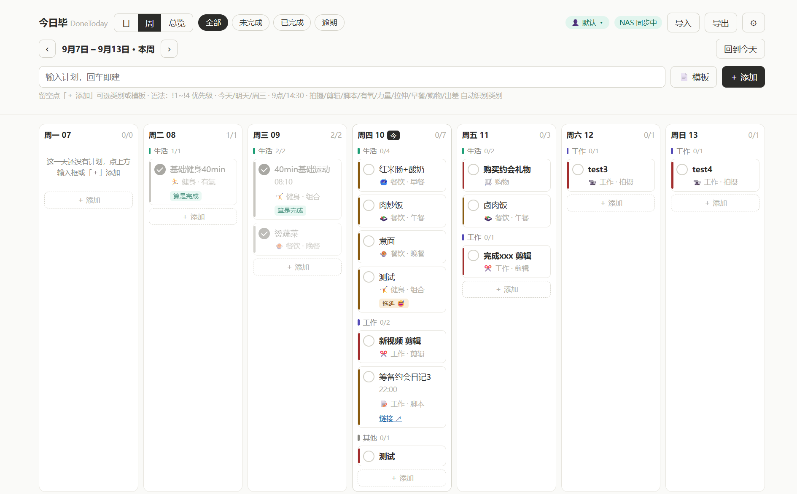
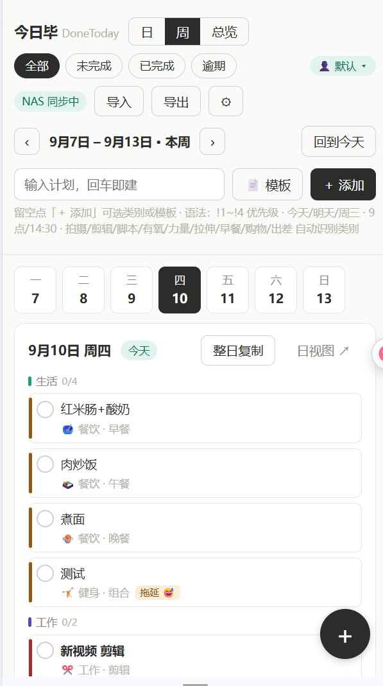

# 今日毕 · DoneToday

> 零依赖、单文件、可离线的每日计划管理页面。双击即用，也可部署到 NAS 实现手机 / 平板 / 电脑实时同步——数据始终在你自己手里。

[](LICENSE)

## 特性

- 📅 **日 / 周 / 月 / 总览** 四视图，生活 / 工作 / 行程 / 其他 四分区布局
- 🏮 **法定节假日**：内置国务院办公厅官方放假安排（含调休「休 / 班」标记），周 / 月 / 日视图自动显示节日名
- 🎯 **四级优先级**（必须完成 / 尽量完成 / 可以延后 / 无所谓），每日自动排序，P1 加粗，过期未完成自动高亮
- ⚡ **极速录入**：快捷语法 `!1 明天9点 拍摄 新品开箱` 一行搞定，输入时实时预览解析结果；提到早餐 / 午餐 / 晚餐自动带上默认时间（9:00 / 12:00 / 19:00）
- 🧩 **自定义类别与分组**：类别、子项、Emoji、分组名与颜色全部可自定义
- 🔁 **组合模板**：如「基础健身 40min」一键拆成有氧 / 力量 / 拉伸三条子任务
- 📋 **批量导入 / 导出**：CSV + JSON，支持时间范围选择
- 👨‍👩‍👧 **多用户**：一人一份数据文件，家庭共用一套部署互不干扰，支持 `?u=名字` 直达
- 🔄 **多设备同步**：NAS WebDAV 或内置小服务，离线自动补传，快照回滚
- 🤔 **诚实的完成机制**：过期任务勾选时会问你——已完成 / 算是完成了吧 / 拖延症犯了（自动顺延到今天）
- 🪶 **零依赖**：原生 HTML/CSS/JS 单文件，无构建、无 CDN、无账号、无云端

## 界面展示

| 电脑端 · 周视图 | 手机端 |
|---|---|
|  |  |

## 快速开始

```bash
# 无需安装，直接打开
双击 index.html
```

多设备同步（NAS / 局域网）部署、快捷语法、模板、导入导出等详细说明见 **[使用指南.md](使用指南.md)**。

## 文件说明

| 文件 | 说明 |
|---|---|
| `index.html` | 应用本体（全部功能内置） |
| `使用指南.md` | 面向普通用户的完整使用与部署指南 |
| `sync_server.py` | 可选：局域网同步小服务（Python 标准库实现，带快照回滚） |
| `导入模板.csv` | 批量导入模板（含示例行） |

## 技术栈

原生 HTML + CSS + JavaScript，约 70KB 单文件。中英文名：今日毕 / DoneToday。存储使用 localStorage（本地模式）或同目录 `dayplan.json`（服务器模式），同步基于 WebDAV GET/PUT 或内置 Python 服务。

## License

[MIT](LICENSE)
